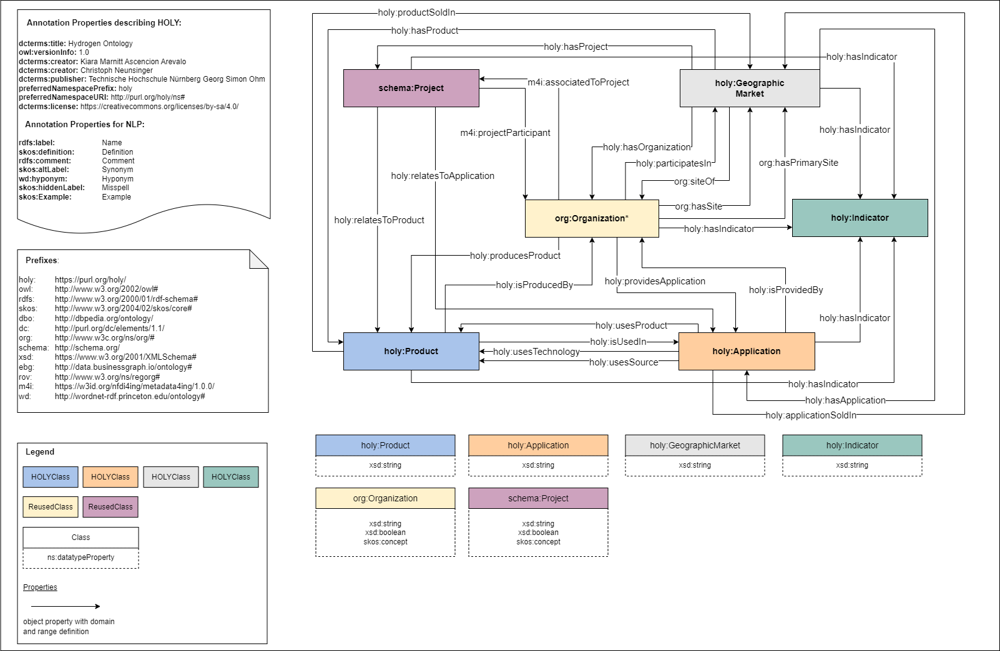

## Hydrogen Ontology
 

The Hydrogen Ontology (HOLY) is a domain ontology for describing the complex structure of hydrogen-based markets. HOLY contributes to the systemic modeling of the hydrogen domain with a focus on its value chain. Hence, it provides a foundation for retrieval, storage, and delivery of market insights. 

The overall structure consists of over 100 classes storing information about organizations, projects, products, applications, markets, and indicators and conceptualizes market relationships of production, cooperation, geographic placement, provision of goods or services, and indicators.

The ontology is  maintained by the [Future Engineering Research Group](https://www.th-nuernberg.de/einrichtungen-gesamt/fraunhofer-forschungsgruppen/future-engineering/), a cooperation in between the Technische Hochschule Georg-Simon-Ohm and the Fraunhofer IIS. Further information of the HOLY project can be found in the [HOLY Website](https://purl.org/holy), to contribute to HOLY  contact the [Future Engineering Group](https://www.th-nuernberg.de/einrichtungen-gesamt/fraunhofer-forschungsgruppen/future-engineering/)

## Repository Structure
The repository contains the following resources:
* The Hydrogen Ontology Ontology in [RDF/Turtle](./holy.html), [RDF/XML](./holy.xml) and [JSON](./holy.jsonld)
* Ontology [Documentation](./documentation) and corresponding [visualizations](./visualizations)
* [License](./LICENSE.md) declaration
<!---* [Results](doc\OOPS!_Evaluation\CQs Evaluation) of validation using the OOPS! tool -->
* [Results](./doc/CQs_Evaluation) of competency questions evaluation

## Permanent URLs
* [HOLY Information](https://purl.org/holy)
* [HOLY Ontology](https://purl.org/holy/ns)
* [HOLY Documentation](https://purl.org/holy/doc)
* [HOLY Repository](https://purl.org/holy/repository)
