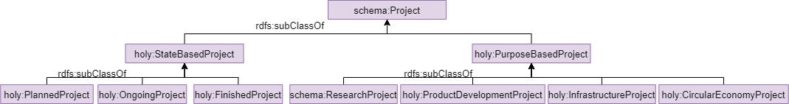

## Description and Commentary

The six core classes of the Hydrogen Ontology HOLY are `org:Organization`, `schema:Project`, `holy:Product`, `holy:Application`, `holy:Indicator` and `holy:GeographicMarket`. This structure is inspired by the Porters 5 Forces framework and market segmentation approaches to ensure a relevant, market-oriented structure. In addition, a top-down approach within the necessary classes is applied to provide a hierarchy which allows clustering from general to specialized.

The internal structure of the classes `org:Organization` and `schema:Project` are hereby completely built from extended structures of existing ontologies from [The Organization Ontology](http://www.w3.org/ns/org), the [Registered Organization Vocabulary](http://www.w3.org/ns/regorg), the [euBusinessGraph](http://data.businessgraph.io/ontology), [Schema.org](http://data.businessgraph.io/ontology), the [Metadata4Ing Ontology](https://w3id.org/nfdi4ing/metadata4ing/1.0.0/) and the [DBpedia Ontology](http://dbpedia.org/ontology/).

The classes `holy:Product`, `holy:Application`, `holy:Indicator` and `holy:GeographicMarket` contain taxonomies concerning the composition of products, use cases, types of projects, economic indicators for markets and companies, as well as location differentiation. These taxonomies were specifically created for the Hydrogen Ontology.

HOLY was designed to be compatible with Natural Language Processing (NLP) methods. Through the properties `skos:example`, `skos:altLabel` and `skos:definition` which describe each class, it includes a semantic component in its structure.

### The Organization Layer

Organizations must be classified since they act as direct or indirect participants within an economic environment. Hereby, organizations can take different roles from being an active manufacturer or service provider to being an indirect player focusing more on governmental or administrative activities within a market.

The Organization layer of HOLY uses ‘[The Organization Ontology](http://www.w3.org/ns/org)’ as its foundation since it provides an established and neutral classification scheme for classifying organizations in their different fields of economic activity. The selected classes supporting this structure are hereby `org:Organization` and `org:FormalOrganization`.

To provide an in-depth classification using classifiers such as NACE, ISIC or SIC, the extending object properties from ‘[The Registered Organization Vocabulary](https://www.w3.org/ns/regorg#)’ have been implemented. To expand the classification of businesses even more, data properties of the [euBusinessGraph](https://raw.githubusercontent.com/euBusinessGraph/eubg-data/master/model/ebg-ontology.ttl) were used.

  
Taxonomy of `org:Organization` in HOLY

#### Properties related to Organization

`org:Organization` has object properties connecting it to the main classes `holy:Product`, `holy:Application`, `schema:Project`, `holy:GeographicMarket` and `holy:Indicator`. The object properties linking `holy:GeographicMarket` and `org:Organization` reveal the location of a company’s economic activity or that of one of its subsidiaries. Properties relating to `holy:Product` and `holy:Application` identify manufacturers of products or application providers. Object properties to `schema:Project` discloses partnerships in previous, current or future projects. The relationship to the class `holy:Indicator` links performance indicators.

Properties going from `org:Organization` to `org:Organization` illustrate intercompany relationships such as being a subsidiary or being linked to a company through other business relations.

  

### The Project Layer

Projects often indicate in which stage of application a certain technology is. To classify information concerning projects, the class `schema:Project` from the Schema.org framework was implemented. The underlying taxonomy divides `schema:Project` into the state and the purpose of the project.

  
Taxonomy of `schema:Project` in HOLY

#### Properties related to Project

`schema:Project` has relationships to the classes `org:Organization`, `holy:Application`, `holy:Indicator`, `holy:Product` and `holy:GeographicMarket`.

Object properties relate to the outcome of a project, allowing classification by either being related to a product (`holy:relatesToProduct`) or an application (`holy:relatesToApplication`). Object properties from the Megadata4Ing ontology connect organizations with projects (`m4i:inProject`/`m4i:projectParticipant`). The object property `holy:hasIndicator` to the class `holy:Indicator` takes criteria such as funding into account. The object property connecting to `holy:GeographicMarket` defines the location of a certain project.

  

### The Product Layer

For representing the hydrogen market, products and technologies play an essential role. The terms ‘product’ and ‘technology' are treated as substitute terms in this ontology based on their interchangeable use in different information sources (such as journal articles, press releases, company sites, and reports). Regarding the current focus on PEMFCs, products other than PEMFCs currently have no further component classes describing their composition.

The schema for `holy:Product` is organized in six different layers. The first subclass layer includes a separation between hydrogen products and substitute products as well as their respective components. For hydrogen products, products are separated in different value chain positions and product types.

  
Taxonomy of `holy:Product` in HOLY

#### Properties related to Product

`holy:Product` relates to the classes `org:Organization`, `schema:Project`, `holy:Indicator`, `holy:Application` and `holy:GeographicMarket`. The object property `holy:isUsedIn` to the class Application and its schema identifies use cases. The object property `holy:producesProduct` shows the producer of a product or technology. The object property `holy:relatesToProduct` creates a connection to show the participation of a product or technology in a certain project. `holy:hasProduct` and `holy:hasIndicator` connect the Product class with the main classes `holy:Indicator` and `holy:GeographicMarket`.

### The Application Layer

It is intended to know the use case for certain products and technologies. Therefore, the class structure of `holy:Application` aims to provide a comprehensive list of possible applications.

`holy:Application`’s taxonomy is similar to `holy:Product`. Its first layer differentiates between mobile and stationary application types. Following a top-down approach, classes further below the taxonomy for `holy:Application` deliver more detailed classes concerning different types of mobile and stationary applications.

Based on the PEMFC focus, the subclass structure for mobile applications is currently more advanced than the structure below `holy:Stationary`.

  
Taxonomy of `holy:Application` in HOLY

#### Properties related to Application

`holy:Application` aligns with classes of `org:Organization`, `schema:Project`, `holy:Indicator`, `holy:Product` and `holy:GeographicMarket`. The object properties `holy:usesTechnology` and `holy:usesProduct` identify if an application is using a technology or a product. A connection to `schema:Project` via `holy:relatesToApplication` connects applications to ventures. The object property `holy:applicationSoldIn` to `holy:GeographicMarket` serves as an addition to `holy:hasApplication` since some components or technologies might be not available for sale in certain markets.

### The Indicator Layer

To provide a structure covering competitiveness and development, the consideration of indicators concerning market size, investment or social development is needed.

The taxonomy for `holy:Indicator` includes classes for investment, employee size, market share, market size and revenue, entry barriers, patent and trend.

  
Taxonomy of `holy:Indicator` in HOLY

#### Properties related to Indicator

`holy:Indicator` has relationships to the classes `schema:Project`, `org:Organization`, `holy:Product`, `holy:Application` and `holy:GeographicMarket`. The incoming object property is `holy:hasIndicator`.

### The Geographic Market Layer

To store geographic data, the addition of the Geographic Market class allows geographic segmentation of the main classes and their underlying structure. To do so, `holy:GeographicMarket` is mapped to the DBpedia ontology to allow for a precise classification.

The taxonomy of `holy:GeographicMarket` consists of two subclasses from Schema.org (`schema:continent` and `schema:country`).

  
Taxonomy of `holy:GeographicMarket` in HOLY

#### Properties related to Geographic Market

`holy:GeographicMarket` relates to the classes `schema:Project`, `holy:Indicator`, `holyApplication` `holy:Product` and `org:Organization` to allow geographic mapping of instances of other classes. `holy:GeographicMarket` also has an object property linking its two subclasses. The object property `dbo:continent` allows mapping with DBpedia to query missing geographic information from the DBpedia ontology.

### Annotation Properties

Annotation Properties from [RDFS](https://www.w3.org/TR/rdf-schema/#ch_label) and [SKOS](https://www.w3.org/TR/skos-reference/#labels) have been used to describe semantic information in the Hydrogen Ontology. The annotation properties integrated in HOLY's classes, together with a description and example from the class `holy:Truck`, are as follows:

  

The references are identical to information from the documentation of [RDFS](https://www.w3.org/TR/rdf-schema/#ch_label) and [SKOS](https://www.w3.org/TR/skos-reference/#labels)